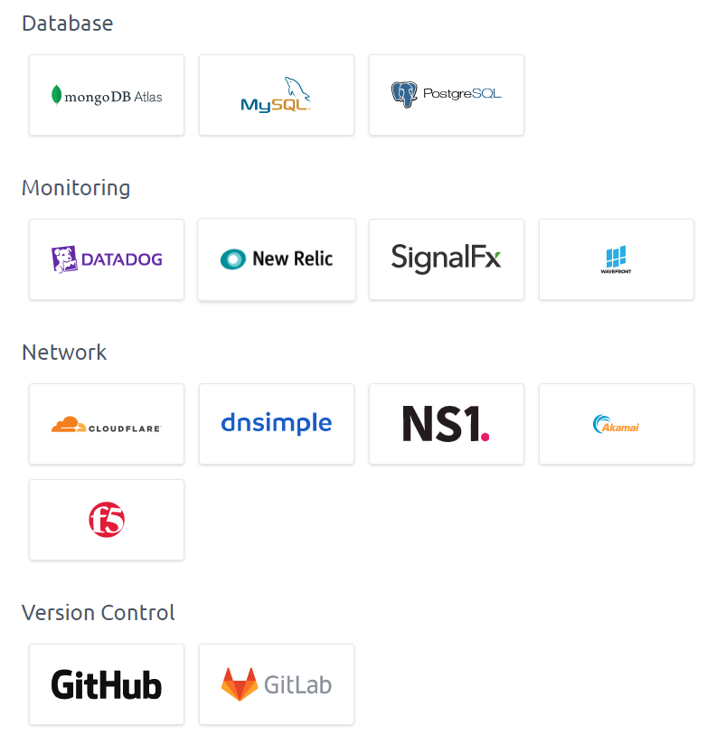

[drag=100]

---

[drag=100]

---

[drag=100]

---

[drag=100]

---

[drag=100]

---

[drag=100]

# Cloud Infrastructure as (.NET) code in Pulumi 

---

[drag=50 100, drop=left, flow=col]

## James Murphy

### @recumbent

Twitter & Github

[drag=50 50, drop=51 51, set=fragment]
### Cloud Software Engineer

Note:

Hi, my name is James Murphy, my job title is cloud software engineer, I first laid hands to keyboard in 1979 and I've been writing code and learning new things ever since

---

[drag=100]

# Pulumi

* www.pulumi.com

Note:

Pulumi is a tool for defining infrastructure as code - programming language type source code, its also a tool and a service for managing deployment of that infrastructure

---
[drag=50 100, drop=left]

# Questions:

@ul[drag=5- 100, drop=right, fit=1.5]
* What is infrastructure as code?
* Why is it a good idea?
* If it _is_ a good idea, why Pulumi?

Note:

That definition immediately raises a few questions - what is infrastructre as code? why is it a good idea? and if it is a good idea then why Pulumi?

---

[drag=100]

# What do we do?

Note:

Let me ask a different question - what is it that we do? At the most basic level we find problems and deliver solutions to those problems - in my case those solutions are deployed to (and take advantages of the services provided by) a public cloud (be that Azure or AWS or GCP or...).

So we have a definition of delivering value that says we need a deployed solution available to our users.

---

[drag=50 100, drop=left]

# Accelerate

Note:

To be effective in delivering we can take guidance from the experience of others - in Accelerate by Dr Nicole Forzgren et al we have clear evidence that the time to go from committed code to deployed application correlates very strongly with high performing teams. 

---

[drag=50 100, drop=left]

# Continuous Delivery

Note:

- This leads us to the principals in Continuous Delivery by Jez Humble and Dave Farley that we build and package _once_ and deploy to multiple environments as needed but that we always deploy in the same way whether it be to the dev environment or to staging or to production.
- I could talk off the cuff about this all day and will happily do so over beers but a key principal is...

---

[drag=50 100, drop=left, set=fragment]

# Automate!

[drag=50 100, drop=right, set=fragment]

# Everything!

Note:

- That we automate. Everything. 
- We automate things to make them trivially repeatable and that has to include deployment.
- If you want to automate everything then using a cloud web console isn't the answer
- So how do we automate definition of infrastructure or the definition of deployed systems (where there is considerable overlap).

---

[drag=100]

# Scripting?

Note: 

There are a couple of approaches - we can "script" things - all of the cloud providers provide rest APIs and command line tools to create and configure services - unfortunately we want our definitions to be idempotent, we want to safely be able to run the script whether the services exist or not and that gets difficult quickly.

---

[drag=50 100, drop=right, fit=0.75, set=fragment]

# Desired State Configuration

Note:

Better is to take the Picard approach, to define what our infrastructure should look like and then tell someone else to "Make it so" - this is "desired state configuration".

The good news is that the public cloud providers support this approach - they have declarative systems for specifying your requirements and engines that magically transforms those specifications into cloud infrastructure. The bad news is that we very quickly end up with a "wall of markup" - be that json or yaml 

---

@code[drag=30 100, drop=left, json, fit=0.2](code/arm-template.json?lines=1-128)

@code[drag=30 100, drop=center, json, fit=0.2](code/arm-template.json?lines=129-256)

@code[drag=30 100, drop=right, json, fit=0.2](code/arm-template.json?lines=257-380)

Note:

This is the azure ARM template for my sample system (over 300 lines long). The equivalent in AWS Cloudformation YAML will be a similar size

The problem with these templates is that they are hard to read and therefore hard to maintain - there is a huge amount of duplicated boilerplate and not a small amount of arcane cleverness where programming concepts are added to markup to overcome the limitiations of straight markup. So the templates require you to understand not only the infrastructure you're targetting but also effectively a whole new language used to create and configure that infrastructure.

---
[drag=50 100, drop=left]

# Team Topologies

Note:

Coming back to our core problem - delivering value by making deployed solutions available - there is a strong argument, outlined in the excellent Team Topologies, that delivery teams (5 to 9 people) should own solutions end to end, if you write it then you should deploy it and you should operate it.

---

[drag=50 100, drop=left]
# Cognitive Load

Note:

A key limiting factor on what an individual and a team can own and operate is how much cognitive load it can support, what it can comfortably think about. Having to understand ARM or Cloudformation or the YAML for Google's Cloud Deployment Manager will consume a goodly chunk of that available load.

So we want something that is both more flexible than XML or YAML and that is more easily understood by the developers on a delivery team - in other words source code.

---

[drag=50 100, drop=left]

# Code...

[drag=50 100, drop=right, fit=1.5]

@ul[]
* AWS CDK
* Azure - [Farmer](https://compositionalit.github.io/farmer/), [Bicep](https://github.com/Azure/bicep)
* Pulumi
  * Multiple Services 
  * Python, Go, Typescript, .NET
@ul

Note:

- For AWS, amazon are providing the CDK
- For Azure there is the very impressive Farmer (its an F# DSL, I'm bound to like it...) and Microsoft are experimenting with Bicep
- Or there is Pulumi, which targets multiple services and which lets you write code in Python, Go, and in languages that support Node.js, and .NET. - and that means it probable that your team can define the system it wants to deploy using something it already understands and removes some of the additional load leaving more to think about the actual problem space rather than how to shave yaks.

The other advantage we gain from having infrastructure defined in text files (whatever the format) is that we can store that infrastructure with our application source code - that we can see it evolve and can audit it in the same way we do all our source code (and we can revert changes in much the same way)

---

[drag=40 100, drop=left]

## Good things...

@ul[drag=60 100, drop=right, fit=2.0]
- Repeatable
- Deploy to multiple environments
- Deploy at whim
- Version controlled
@ul

Note: 

At this point I think its clear that defining our infrastructure in a text file is a good thing

- It makes deployment repeatable
- It makes it possible to deploy to as many environments as we want
- It makes it trivial to deploy as and when we want
- We can use version control which gives us a history and the ability to audit and control what we do.

---

[drag=50 100, drop=left]

# Pulumi

@ul[drag=50 100, drop=right, fit=1.5]
* Language independence
* Deployment management
* Platform independence
@ul

Note:

On top of this Pulumi gives us, just to start with...

- A degree of language independence
- A service/system for managing multiple deployments of the same system and of diverse systems
- A degree of target platform independence
  
---

Note:

 - The usual suspects of AWS, Azure, Google Cloud, and Kubernetes
 - More cloud providers - like Alibaba and Digital Ocean
 - Infrastructure providers - docker, pager duty, azure devops
 - And diverse other things - Databases, Monitoring, Network, and version control - although I think Github (for example) is much closer to a full development lifecycle tool

---

[drag=100 drop=center]

# Pulumi _all_ the things

Note:

I want to use pulumi for everything... think about this in the context of onboarding and off-boarding a developer, or any other technical specialist, and the access and privileges they need to the services you use. But also in terms of having all your repositories set up in a consistent manner (and knowing what that should look like).

---

[drag=100]

# How...

Note:

That's probably enough why - although I could easily fill the rest of my time, but I promised some code and I think that seeing code is important

So time for some how.

---

[drag=100 20, drop=top, fit=0.8]
# Demo System Architecture

Note:

Suppose we have an application something like this - we make a request, it looks to see if already has the answer - if not it goes to a 3rd party service, pulls the appropriate data, transforms it, caches it in a data store and then returns the result.

For this example I'll use a function for the service, and a blob or S3 for the storage - one might more usually use table storage or something like redis

This is a very simplified version of real systems that I've worked on

---
[drag=100]

### Getting started

Note:

Pulumi operates from the command line - so we install by appropriate means for your dev platform - it runs on Windows, and Mac, and Linux

Once installed

---?terminal=sessions/pulumi-new.cast&font=20px&theme=monokai&poster=npt:0:00&color=#DDDDDD

Note:

I have a new almost empty repo

I create a folder for the project

I need to login - to define the location for storage

---

@code[cs, drag=100 drop=center](code/010-Pulumi-new/Program.cs)

Note:

What's in this? Lets take a look.

The entry point is in program.cs, at this point it does very little, it magically invokes a class - its what's in that class that is interesting

---

@code[drag=99, drop=center, cs,  fit=0.75](code/010-Pulumi-new/MyStack.cs)

@[9-10](Creates a resource group)
@[13-18](Creates a storage account in the resource group)
@[20-21](Exports the connection string)
@[24-25](Outputs are defined as properties)

Note:

Going top down, we have a resource group

A storage account - in the resource group (the location is pulled from the config)

Finally we set the connection string as an output - which is defined as a property on the class.

This corresponds to the output from preview we saw earlier.

Also, for all of this we rely on Pulumi's magic naming which will append a 8 character random string to the name

I want to make a few changes before I deploy that though

---

@code[drag=99, drop=center, cs code-reveal-slow, fit=0.75](code/020-Intial-deploy/AzureStack.cs)

@[5-7](Rename the stack)
@[9-10](Read `DeployTo` from stack config)
@[12-19](Explicitly name the resource group)
@[29-30](Save the name not the connection string)

Note:

The template never matches what we really want...

- We'll give the stack a better name
- We'll read deploy to from the configuration - and fail if its not there
- We'll explicitly name the resource group - by default Pulumi appends random numbers for name - this is great for ensuring uniqueness but not entirely dev friendly
- And of cours the connection string is supposed to be a secret 

---
[drag=100]

# First Deployment

Note:

Its time we actually deployed something... 

---
### Empty Subscription

Note:

The azure subscription before I started - no resources of any kind

---?terminal=sessions/pulumi-up.cast&font=20px&theme=monokai&poster=npt:0:00&color=#DDDDDD

Note:

as this is a recording some sequences may have been shortened...
---

[drag=20 10, drop=topleft]
### It lives!

Note:

And now the same azure subscription - this time with resources

---

@code[drag=99, json, fit=0.75](code/030-Stack-json/azure-dev.json)

@[4](This is the azure-dev stack)
@[41-44](This defines the resource group)
@[66-69](Storage account)

Note:

So how does pulumi keep track, well it uses a wall of JSON...

Here we see the URN identifying the resource for pulumi
An id which is the _azure_ id
And a type so that pulumi knows what we're looking at
Here's the storage account - urn is similar but references a storage account

---

[drag=100]

# Something useful?

Note:

Time to add something that actually does something useful

---

@code[drag=99, fs, fit=0.75](code/040-Add-function/Startup.fs)

@[26-31](Read config)
@[22](Use environment variables)

Note:

This is the startup code for the function we're going to deploy - it in F# but that doesn't really matter, what is important is that it needs some config values

---

@code[drag=99, cs code-reveal-slow, fit=0.75](code/040-Add-function/AzureStack.cs)

@[29-41](Two containers)
@[43-52](An app service plan)
@[59](Zip the publish folder)
@[54-60](Store in zip container)
@[62-63](Get the url for the blob)
@[65-80](Finally create the function)
@[73-75](Setting values for config)
@[83](Output the endpoint name)

Note:

Well add the resources to our stack

- Firstly a couple of containers - one for the packaged code and one for the runtime data
- Secondly an application service plan - the Sku is arbitrary magic

- That's a smidge over 90 lines including whitespace and you can see the relation between the pieces

---

@code[drag=30 100, drop=left, json, fit=0.4](code/040-Add-function/AzureStack.cs?lines=-1-31)

@code[drag=30 100, drop=center, json, fit=0.4](code/040-Add-function/AzureStack.cs?lines=-32-62)

@code[drag=30 100, drop=right, json, fit=0.4](code/040-Add-function/AzureStack.cs?lines=-63-93)

Note:

And here's the whole thing, you might almost be able to read this

---

[drag=100]

# Deploy and run

Note:

This would be better "live" but...

---?terminal=sessions/add-azure-function.cast&font=20px&theme=monokai&poster=npt:0:00&color=#DDDDDD

Note:

Two different instances of the stack, zero code changes - same code for both

---
[drag=50 10, drop=0 0]

### Two resource groups

---
[drag=100]

# AWS

Note:

I promised the same for AWS as well...

---

@code[drag=99, cs](code/050-Init-Aws/MyStack.cs)

@[2](Using Pulumi.Aws.*)
@[6-13](Is AWS, you always need an S3 bucket)

Note:

&lang=csharp code-max code-wrap

The templated code for AWS is fairly minimal too

Lets add the lambda

---

@code[drag=99, cs, fit=0.75](code/060-Aws-lambda/AwsStack.cs)

@[11-12](Same as for Azure)
@[14-18](Tags because no resource group)
@[20-27](Named bucket with tags)
@[29-47](Role to run the lambda)
@[49-65](Policy to write logs)
@[67-90](Policy to let the lambda use S3)
@[71](Magic to pick up unknown values)
@[79](Note use of ARN)
@[97](Zip the publish folder (again))
@[101-105](Configure with env vars (again))
@[92-111](Function creation)

Note:

Very similar to azure
I hate policies - but you can write code and use libraries to simplify these (there's a typescript lib for all the policies)

Whilst the types and the details vary the patterns are the same, the language is the same and you've got IDE help.

---
[drag=100]

# Pulumi Up one more time...

---?terminal=sessions/aws-lambda.cast&font=20px&theme=monokai&poster=npt:0:00&color=#DDDDDD

Note:

Non-interactive because you should be running this as part of your CI pipeline

Ideally I'd add an API Gateway and show you this working from an http request - but I'd forgotten how many hoops one has to jump through so I'll spare you that.

---
[drag=100]

### It is deployed

---
[drag=100]

### And it does work

---
[drag=50 100, drop=left]

## One last example 

@ul[drag=50 100, drop=right, fit=1.5]
* Real code (almost - names changed etc)
* for Azure, in F# - getting a bit meta.
@ul

Note:

Everything in this turned out to be surprisingly straightforward, the problem was in knowing what to do not in actually doing it.

---

@code[drag=99, fs code-wrap, fit=0.75](code/070-Meta/Program.fs)

@[199-203](Combine the output from two sets  of infrastructure)
@[36-50](Add DNS for a domain)
@[26-34](Add records for sendgrid)
@[21-24](Create a cname)
@[52-199](Pulumi infrastructure)
@[12-19](List of users)
@[61-66](Get a list of user ObjectIds)
@[67-77](Create a group in AzureAD)
@[88-96](SP for automation)
@[98-109](Let the SP create things)
@[165](Want to create a key vault)
@[140-142](Need a list of key permissions - code)
@[144-146](And secret permissions)
@[148-154](For a policy)
@[164-173](Creating the key vault)
@[176-184](And a key)

Note:

This is DNS and the infrastructure we're using to run pulumi

I needed to create a group in AzureAD to control access to a key vault.

I have a list of users that I want in the group... 

Pulumi lets me look up existing users

Given the list of existing users I can extract their ids and use those when I create a group.

And that's it, I can then use the group to create my vault...

When we need to add or remove users we change that list, run the stack, and we're done.

Over time I hope we'll be able to apply this to all our dev infrastructure - we'll import the exist resources etc into stacks and then build out from there. There are some security concerns, but equally there is a huge upside to working this way - in particular onboarding will be a matter of adding a user to the right list and working from there. But equally adding a new repository with the rules we require should be the same, add the name to the right list, go...

---
[drag=100]

# Enough already...?

Note:

Ok... so that barely touches the surface of what's possible - but this is _all code_ and hopefully code that you understand be that C#, F#, Python, Go, or Typescript. 

---
[drag=40 100, drop=left]

## What Have I missed

@ul[drag=60 100, drop=left]
* Secrets
* Passing values between stacks
* Taking advantage of code to remove boilerplate and enforce standards
* Shiny new Automation API
@ul

---
[drag=40 100, drop=left]

## Open questions

@ul[drag=60 100, drop=left]
* How to architect your _stacks_
@ul

---
[drag=40 100, drop=left]

## Potential issues

@ul[drag=60 100, drop=left]
* Updates to providers
  * _But_ next gen providers are coming
* Independent of the cloud providers
* Documentation... (impossible problem CDK is the same)
@ul

---
[drag=40 100, drop=left]

## Resources

[drag=60 100, drop=right]
* https://github.com/recumbent/ddd-2020
* https://pulumi.com
* https://github.com/pulumi
  * https://github.com/pulumi/examples
  * Pulumi Community Slack
* https://twitter.com/recumbent
* https://blog.murph.me.uk - when I've recovered...
* https://gitpitch.com/recumbent/ddd-2020/main

---
[drag=100]

# Finally!

Thank you for listening

Note:

If anyone has survived this long - thank you for your attention.
I've only been working with Pulumi for a few of months so have much to learn - but I will answer any questions I can...
I'm planning on being around all day if anyone wants to ask me about, well, anything!
Bye!
